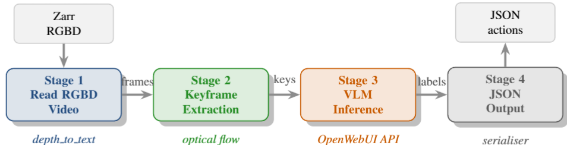
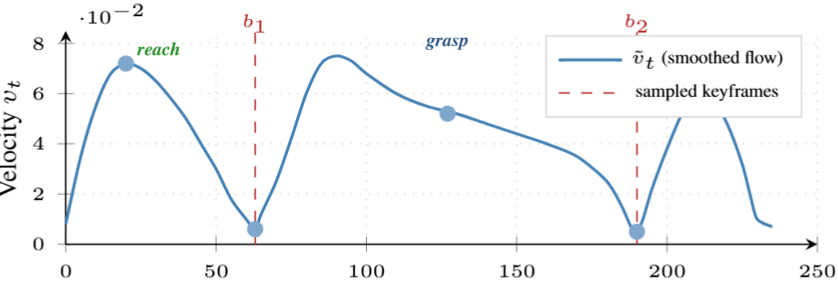

<div align="center">
  <h1>VLM Action Acquisition</h1>
  <a href="https://www.researchgate.net/publication/405824105_Acquiring_Low-Level_Robot_Actions_from_RGBD_Video_Using_Vision-Language_Models">

## 📖 Introduction
This project processes RGB-D robot trajectories and utilizes Vision-Language Models (VLMs) to extract and serialize structured action steps. The pipeline handles keyframe extraction, RGB-D preproce[...]

### Architecture & Signals

<table>
  <tr>
    <td align="center" width="50%">
      <b>Four-Stage Pipeline Architecture</b><br>
      
    </td>
    <td align="center" width="50%">
      <b>Optical-Flow Velocity Signal</b><br>
      
    </td>
  </tr>
</table>

## ⚙️ Installation
Install the required dependencies from `requirement.txt`:

```bash
pip install -r requirement.txt
```

## Usage

You can run the full extraction pipeline with the following command (replace the credentials with your own):

```bash
python pipeline.py \
  --reflect_data ./real_data \
  --frame_step 3 \
  --ollama_url <Local Hosted server> \
  --user_id <your_email> \
  --api_key <your_api_key> \
  --model qwen3-vl:latest
```

## 📄 Paper
Paper link: *Coming soon!*
